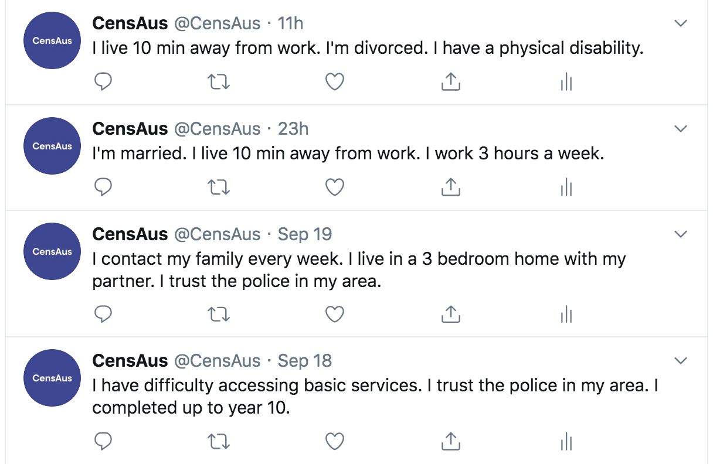

# CensAus
CensAus is a Twitter bot that tweets short biographies of real Australians based on the data they provide to the Australian Bureau of Statistics between 2002 and 2010. Using a Python program, the bot transforms numbers and characters from the Australian Census Data into narratives and once every 12 hours, translates a row of data into a real person. You can find @CensAus <a href="https://twitter.com/CensAus" target="_blank">here</a>.

## The Data
CensAus utilises Microdata, in particular, Confidentialised Unit Record Files (CURFs), taken from the Australian Bureau of Statistics and transforms this data into small stories that describe real Australians who participated in the Census from 2002 onwards. CURFs are composed of a limited subset of Microdata (answers to individual questions on survey questionnaires by the Australian Census) which is released to the public. The CURFs is assembled in a manner to allow researchers to generate rich profiles but not so much detail that the Microdata can be deanonymised and reveal these identities. 

> "The most basic of the techniques employed by the ABS involves removing all identifying information, such as names and addresses. Additionally, the data items that are most likely to enable identification of unit records are only released in broad categories. For example, while survey questionnaires may capture your home or business address, microdata may only be released at the State or Territory level.
> 
> More advanced confidentialisation occurs through checking the CURFs for records with uncommon combinations of responses. These records may be altered slightly to ensure individual respondents cannot be identified."

###### (Quote extracted from <a href="https://www.abs.gov.au/websitedbs/D3310114.nsf/home/CURF:+What+is+CURF+Microdata" target="_blank">ABS</a>).

## The Motivation Behind CensAus
Census data is often viewed at a large scales, aggregates and interactive visualisations. Due to this, Census data is often consumed passively, resulting in a lack of understanding of the humans who make up those top-line numbers. What about the people behind the numbers? 

When such aggregate data is viewed in per entry, a short glimpse of human life is revealed. Through just a few descriptors such as where these people work, how many children they take care of, where they are born or their feelings of safety — we can gain a sense of connection with the people around us. 

A Twitter bot automatically broadcasts a new narrative every 12 hours onto your Twitter feed. CensAus will insert a stranger into your life until it reaches the end of the 28,403 in the data set, which will take about 1.62 years if no further data is added.

## Technical Details
The data is processed into 3 main steps:
1. Isolate the columns within the .csv file and turn the raw data into readable form using dictionaries. For example, column *REGMAR* with a value of *2* translated to "I am widowed". This step creates a file of large sentences that is further modified to create the short biographies that are tweeted.
2. Check each entry from the previous step and combine tweets from 3-5 sentences until each entry is between the 140-280 character limit for a tweet.
3. Using the python Twitter API, post a row from the resulting .csv file. Setting up the Twitter account and creating an application to run the script can be done by following <a href="http://www.storybench.org/build-google-spreadsheet-auto-tweets-archives/" target="_blank">these</a> instructions by Aleszu Bajak.

## Some Past Tweets
> "I contact my family every week. I live in a 3 bedroom home with my partner. I trust the police in my area."

> "I have difficulty accessing basic services. I trust the police in my area. I completed up to year 10."

> "I live 10 min away from work. I'm divorced. I have a physical disability."

## Improvements
  - Make notification email for when script fails
  - Make geo-located tweets according to state
